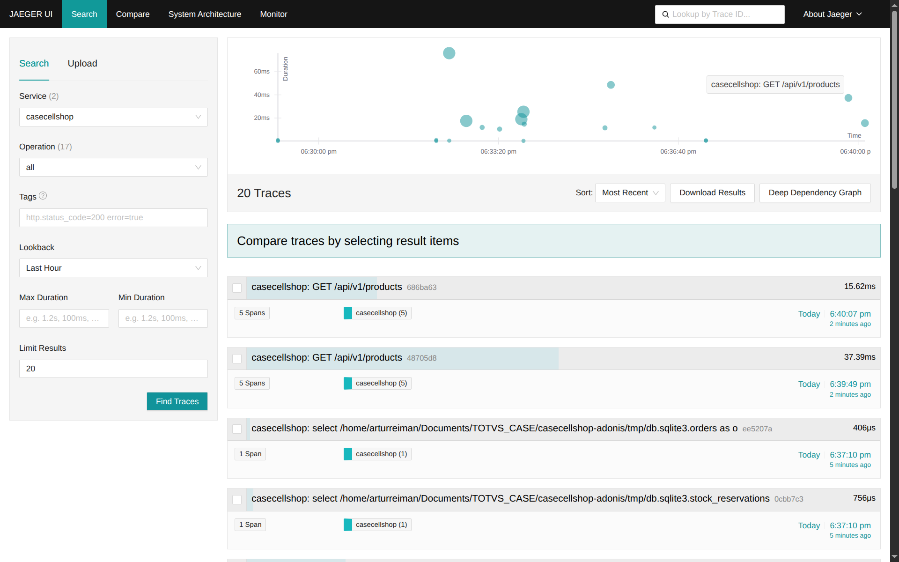
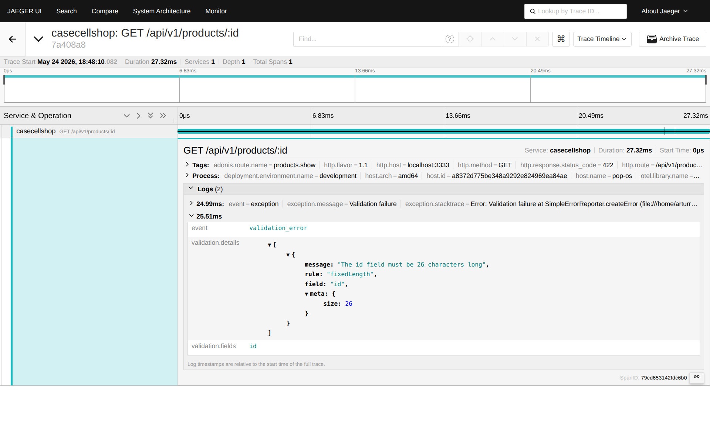
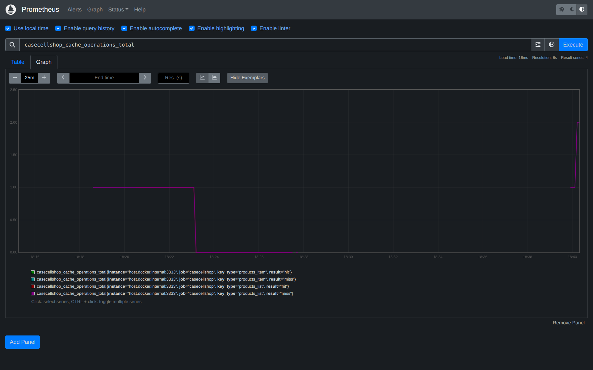
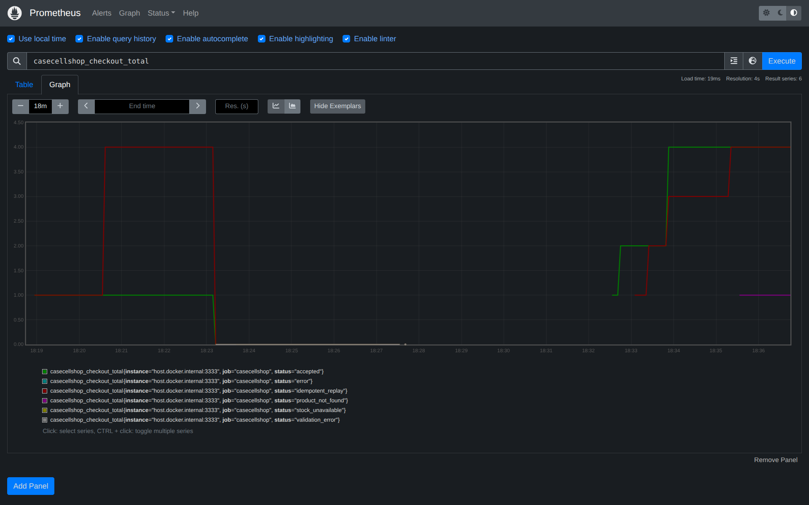

# CaseCellShop API

**Desafio Técnico Backend TOTVS** — Sistema de checkout assíncrono para uma loja de capinhas de celular.

Construído com **AdonisJS v6** · **SQLite** · **Redis** · **BullMQ** · **TypeScript**

---

## Sumário

- [Visão Geral da Arquitetura](#visão-geral-da-arquitetura)
- [Stack Tecnológica](#stack-tecnológica)
- [Início Rápido](#início-rápido)
- [Endpoints da API](#endpoints-da-api)
- [Regras de Negócio](#regras-de-negócio)
- [Decisões de Design e Trade-offs](#decisões-de-design-e-trade-offs)
- [Monitoramento e Observabilidade](#monitoramento-e-observabilidade)
- [Testes](#testes)
- [Limitações](#limitações)
- [Variáveis de Ambiente](#variáveis-de-ambiente)

---

## Visão Geral da Arquitetura

```
┌─────────────────┐    HTTP     ┌─────────────────────────────────────┐
│     Cliente     │ ──────────► │  AdonisJS v6 (Servidor HTTP)        │
└─────────────────┘             │                                     │
                                │  Controllers → Services → DB/Redis  │
                                │                                     │
                                │  POST /checkout                     │
                                │   1. Verificação de idempotência    │
                                │   2. Reserva atômica de estoque     │
                                │   3. Cria pedido PENDING            │
                                │   4. Enfileira job BullMQ           │
                                │   5. Retorna 202 Accepted           │
                                └──────────────┬──────────────────────┘
                                               │ Fila BullMQ (checkout)
                                               ▼
                                ┌─────────────────────────────────────┐
                                │  Worker BullMQ — Saga de Pagamento  │
                                │                                     │
                                │  Step 1: pagamento                  │
                                │    → PAYMENT_PROCESSING             │
                                │    → sucesso: enfileira Step 2      │
                                │    → cartão recusado: PAYMENT_FAILED│
                                │    → erro gateway: retry (3x)       │
                                │                                     │
                                │  Step 2: faturamento ERP            │
                                │    → BILLING                        │
                                │    → sucesso: CONFIRMED             │
                                │    → 4xx: FAILED (reserva liberada) │
                                │    → 5xx: retry (5x, exponencial)   │
                                │                                     │
                                │  Ao esgotar: reserva liberada       │
                                └─────────────────────────────────────┘
```

### Máquina de Estados

```
                    ┌─► PAYMENT_FAILED  (cartão recusado / gateway esgotado)
                    │
PENDING ──► PAYMENT_PROCESSING ──► BILLING ──► CONFIRMED
                                      │
                                      └─► FAILED  (erro ERP, reserva liberada)

PENDING ──► EXPIRED  (TTL da reserva atingido antes do worker processar)
```

---

## Stack Tecnológica

| Camada | Tecnologia |
|--------|-----------|
| Framework | AdonisJS v6 (API kit) |
| Linguagem | TypeScript 6 |
| Banco de Dados | SQLite (via better-sqlite3 + Lucid ORM) |
| Cache | Redis 7 (via @adonisjs/redis + ioredis) |
| Filas | BullMQ 5 (armazenado em Redis) |
| Validação | VineJS |
| IDs | ULID (ordenável lexicograficamente) |
| Timestamps | Luxon DateTime |
| Docs | adonis-autoswagger (OpenAPI 3.0) |
| Métricas | prom-client → Prometheus |
| Traces | @adonisjs/otel (OpenTelemetry → Jaeger) |
| Testes | Japa (runner nativo do AdonisJS) |

---

## Início Rápido

### Pré-requisitos

- Node.js 20+
- Redis 7 rodando em `localhost:6379`

### Opção A — Docker (recomendado)

```bash
cd casecellshop-adonis
npm run infra:up        # docker compose up -d
                        # sobe Redis · Redis Commander · Prometheus · Jaeger
```

Equivalente a executar `docker compose up -d` diretamente.

### Opção B — Redis do sistema

```bash
# Ubuntu/Debian
sudo systemctl start redis
```

### Instalar e executar

```bash
npm install
node ace migration:run
node ace db:seed
npm run dev             # http://localhost:3333
```

### Resetar o banco de dados

```bash
npm run db:fresh        # rollback + migrate + seed
```

> **⚠️ Importante — faça flush no Redis ao resetar o banco.**
> O cache de idempotência (TTL 24h) e o cache de produtos ficam no Redis.
> Se você resetar o SQLite sem limpar o Redis, IDs antigos de pedidos permanecem
> em cache e uma `Idempotency-Key` repetida retorna 202 referenciando um pedido
> que não existe mais no banco (404 em `GET /orders/:id`).

```bash
docker exec casecellshop-adonis-redis redis-cli FLUSHALL
npm run db:fresh
```

---

## Endpoints da API

Documentação interativa: **`http://localhost:3333/docs`**  
OpenAPI JSON: `http://localhost:3333/swagger`

### `GET /api/v1/products`

Lista o catálogo de produtos. Os resultados são cacheados no Redis por **5 minutos**.

**Parâmetros de consulta:**

| Parâmetro | Tipo | Padrão | Descrição |
|-----------|------|--------|-----------|
| `page` | number | `1` | Número da página (começa em 1). Fórmula: `offset = (page − 1) × limit` |
| `limit` | number | `50` | Itens por página (máximo 100) |

**Resposta:**
```json
{
  "data": [
    {
      "id": "01JVPRD000000000000PRDC001",
      "name": "Capinha Silicone Premium iPhone 15",
      "description": "Capinha de silicone macio anti-impacto para iPhone 15",
      "category": "silicone",
      "price": 3990,
      "imageUrl": null,
      "createdAt": "2026-05-23T14:00:00.000+00:00",
      "updatedAt": "2026-05-23T14:00:00.000+00:00"
    }
  ],
  "total": 10,
  "meta": { "fromCache": false, "page": 1, "perPage": 50 }
}
```

---

### `GET /api/v1/products/:id`

Retorna um produto pelo seu ULID.

---

### `POST /api/v1/checkout`

Cria um pedido. Retorna **202 Accepted** imediatamente. O faturamento no ERP ocorre de forma assíncrona — consulte `GET /orders/:id` para acompanhar o status final.

#### Dados de seed (prontos para usar no Swagger "Try it out")

**Clientes** — use qualquer um como `customerId`:

| Nome | customerId |
|------|-----------|
| Alice | `01JVMN00000000000000TEST01` |
| Bob | `01JVMN00000000000000TEST02` |
| Charlie | `01JVMN00000000000000TEST03` |

**Produtos** — use qualquer um como `productId`:

| Produto | productId | Preço |
|---------|-----------|-------|
| Capinha Silicone Premium iPhone 15 | `01JVPRD000000000000PRDC001` | R$ 39,90 |
| Capa Couro Genuíno Samsung Galaxy S24 | `01JVPRD000000000000PRDC002` | R$ 129,90 |
| Capinha Crystal Clear iPhone 14 | `01JVPRD000000000000PRDC003` | R$ 29,90 |
| Capa Rugged Militar Motorola Edge 40 | `01JVPRD000000000000PRDC004` | R$ 89,90 |
| Capinha Silicone Xiaomi 13T | `01JVPRD000000000000PRDC005` | R$ 44,90 |

> Todos os produtos são seedados com **50 unidades** em estoque.

#### Header Idempotency-Key (obrigatório)

```
Idempotency-Key: <sua-string-unica>   # máx 255 chars — qualquer formato aceito
```

Gere um novo valor **por tentativa de compra**. A mesma chave sempre retorna o mesmo `202` (replay idempotente, sem efeitos colaterais). As chaves expiram após **24 horas**.

Formas rápidas de gerar uma chave:
```bash
# Usando Node.js
node -e "const {ulid} = require('ulid'); console.log(ulid())"

# Usando uuidgen (Linux/Mac)
uuidgen

# Qualquer string aleatória também funciona:
# "meu-teste-001", "checkout-2026-05-23-001", etc.
```

No Swagger UI "Try it out", basta digitar qualquer string única — ex: `test-order-001`. Mude para cada nova tentativa de checkout para evitar replay idempotente.

#### Requisição

```
Idempotency-Key: test-order-001
Content-Type: application/json
```

```json
{
  "customerId": "01JVMN00000000000000TEST01",
  "productId": "01JVPRD000000000000PRDC001",
  "quantity": 1
}
```

**Resposta `202`:**
```json
{
  "orderId": "01JVSAMPLE00000000ORDERID01",
  "status": "PENDING",
  "message": "Order received. Payment is being processed.",
  "links": { "status": "/orders/01JVSAMPLE00000000ORDERID01" }
}
```

**Respostas de erro:**
- `409 Conflict` — Estoque insuficiente ou request já em andamento
- `404 Not Found` — `productId` desconhecido
- `422 Unprocessable Entity` — Erro de validação (campos ausentes, header `Idempotency-Key` faltando)

---

### `GET /api/v1/orders/:id`

Consulta o status do pedido após o checkout.

**Resposta `200`:**
```json
{
  "id": "01JVSAMPLE00000000ORDERID01",
  "customerId": "alice",
  "productId": "01JVPRD000000000000PRDC001",
  "productName": "Capinha Silicone Premium iPhone 15",
  "quantity": 2,
  "unitPrice": 3990,
  "totalAmount": 7980,
  "status": "CONFIRMED",
  "erpJobId": "billing-01JVSAMPLE00000000ORDERID01",
  "failureReason": null,
  "idempotencyKey": "my-key-123",
  "createdAt": "2026-05-23T14:00:00.000+00:00",
  "updatedAt": "2026-05-23T14:00:15.000+00:00"
}
```

---

### `GET /health`

```json
{ "status": "ok", "timestamp": "2026-05-23T14:00:00.000Z" }
```

### `GET /metrics`

Métricas Prometheus (formato prom-client).

### `GET /docs` · `GET /swagger`

Swagger UI / OpenAPI 3.0 JSON.

---

## Regras de Negócio

### Reserva Atômica de Estoque

O estoque é controlado via **reservas** em vez de decrementos diretos. A reserva é criada dentro de uma transação usando um único `INSERT … SELECT` que verifica a disponibilidade inline:

```sql
-- Disponível = estoque físico − reservas ativas (não liberadas, não expiradas)
INSERT INTO stock_reservations (id, order_id, product_id, quantity, expires_at, ...)
SELECT ?, ?, ?, ?, ?, ...
FROM stocks s
WHERE s.product_id = ?
  AND (
    s.quantity - COALESCE(
      (SELECT SUM(r.quantity)
       FROM stock_reservations r
       WHERE r.product_id = s.product_id
         AND r.released_at IS NULL
         AND r.expires_at > ?),
      0
    )
  ) >= ?
```

Se o estoque disponível for insuficiente, o `SELECT` retorna 0 linhas → 0 linhas inseridas → a transação reverte → `409 Insufficient stock`. Como a verificação e a inserção são uma **única instrução SQL**, não existe janela de race condition (TOCTOU).

As reservas ficam ativas por **15 minutos** enquanto pagamento/faturamento processam. Em caso de sucesso, a reserva é liberada e um decremento permanente é aplicado no estoque. Em caso de falha ou timeout, a reserva é liberada e o estoque retorna ao pool.

> **Nota SQLite**: o modo WAL permite leituras e escritas concorrentes. O INSERT…SELECT em instrução única é serializado pelo lock de escrita do SQLite, garantindo prevenção correta de oversell. Em PostgreSQL, substitua por `SELECT … FOR UPDATE` na tabela `stocks` ou isolamento `SERIALIZABLE`.

### Idempotência (padrão Stripe)

Toda requisição de checkout deve incluir o header `Idempotency-Key`. O serviço:

1. Verifica no Redis se há uma resposta em cache (TTL 24h)
2. Se encontrado → retorna o `202` original (sem efeitos colaterais)
3. Adquire lock in-flight (NX → TTL 30s) para prevenir duplo-clique simultâneo
4. Executa a transação
5. Armazena a resposta no Redis

### Faturamento ERP Assíncrono — Saga de Dois Passos

O worker BullMQ executa dois tipos de job sequenciais por checkout:

1. **`process-payment`** — simula o gateway de pagamento
2. **`process-billing`** — simula a chamada de faturamento ao ERP

Configurável via variáveis de ambiente:

| Variável | Padrão | Descrição |
|----------|--------|-----------|
| `ERP_FAILURE_RATE` | `0` | % de chamadas ao ERP que falham (0–100) |
| `PAYMENT_FAILURE_RATE` | `0` | % de chamadas ao gateway de pagamento que falham (0–100) |

Comportamento em falhas:

| Cenário | Tentativas | Status final | Reserva |
|---------|-----------|-------------|---------|
| Pagamento: cartão recusado (4xx) | Nenhuma | `PAYMENT_FAILED` | Mantida (cliente pode retentar) |
| Pagamento: erro no gateway (5xx) | 3x exponencial | `PAYMENT_FAILED` | Liberada ao esgotar |
| Faturamento ERP: erro de negócio (4xx) | Nenhuma | `FAILED` | Liberada |
| Faturamento ERP: erro técnico (5xx) | 5x exponencial | `FAILED` | Liberada ao esgotar |
| Tudo certo | — | `CONFIRMED` | Liberada, estoque decrementado permanentemente |

### Recovery Job

Um job em background roda a cada **5 minutos** para detectar pedidos presos em `PENDING` há mais de 5 minutos (órfãos causados por crash do servidor após inserir o pedido mas antes de enfileirar o job BullMQ). Eles são re-enfileirados automaticamente.

---

## Decisões de Design e Trade-offs

### Por que AdonisJS?

AdonisJS oferece DI integrado, validação VineJS de primeira classe, Lucid ORM com migrations tipadas e separação limpa entre controllers/services. Isso corresponde à arquitetura alvo descrita em `solucao.md` sem necessidade de boilerplate manual.

### Por que SQLite?

O desafio requer uma configuração local simples. O SQLite com modo WAL suporta leituras concorrentes e serializa escritas — suficiente para demonstrar o padrão de reserva atômica. Em produção, troque para PostgreSQL alterando o bloco `connections` em `config/database.ts` e instalando o pacote `pg`.

### Por que ULID em vez de UUID?

ULIDs são ordenáveis lexicograficamente (os primeiros 10 caracteres codificam milissegundos), ou seja, `ORDER BY id` é implicitamente cronológico — sem necessidade de índice extra em `created_at` para a maioria das queries. São também seguros para URLs e codificados em Crockford Base32 (sem caracteres ambíguos).

### Por que BullMQ em vez de setTimeout puro?

O BullMQ persiste jobs no Redis, sobrevive a reinicializações do processo, suporta backoff exponencial e oferece visibilidade dos jobs (status, contagem de retries). Um `setTimeout` simples perderia todo o trabalho de faturamento pendente em caso de crash.

### Idempotency-Key: qualquer string vs. apenas ULID

O header `Idempotency-Key` aceita **qualquer string** (1–255 chars) em vez de impor o formato ULID. Isso segue o funcionamento de Stripe, Adyen e outras APIs de pagamento — os clientes escolhem seu próprio formato de chave (UUID, ULID, timestamp, etc.). A garantia de unicidade é imposta pelo lock NX no Redis, não pelo formato.

### Preços em Centavos

Todos os preços são armazenados como inteiros (centavos) para evitar erros de arredondamento em ponto flutuante em cálculos de moeda. `R$ 39,90` é armazenado como `3990`.

---

## Monitoramento e Observabilidade

Três camadas complementares oferecem visibilidade completa do sistema: logs estruturados, métricas de negócio e traces distribuídos.

### Visão geral da stack

```bash
npm run infra:up   # docker compose up -d → Redis + Prometheus + Jaeger + Redis Commander
npm run dev        # inicia o servidor da API
```

| Ferramenta | URL | Finalidade |
|------------|-----|-----------|
| Prometheus | http://localhost:9090 | Coleta `/metrics` a cada 5s — consulte contadores e histogramas |
| Jaeger | http://localhost:16686 | UI de traces distribuídos (OTel) — árvore completa de spans |
| Redis Commander | http://localhost:8081 | Inspecione chaves Redis (cache, jobs BullMQ) |

---

### Camada 1 — Logs Estruturados (pino)

Cada linha de log carrega `requestId` (ULID do `X-Request-Id`) e `orderId` quando aplicável. Em desenvolvimento, os logs são renderizados com cores via **pino-pretty**. O helper `otelLoggingPreset()` injeta automaticamente `trace_id` e `span_id` em cada linha, vinculando os logs diretamente ao trace no Jaeger.

```
[16:30:01.123] INFO (casecellshop): checkout.accepted
  requestId: "01HVXXXXXXXXXXXXXXXXXXXXXX"
  orderId:   "01HVXXXXXXXXXXXXXXXXXXXXXX"
  trace_id:  "dd6005b5e5d28a8a677f9cbf5afd99b0"
  span_id:   "7a6390457ddbb367"
```

Em produção (`NODE_ENV=production`), os logs são emitidos como JSON puro para stdout, prontos para ingestão em qualquer agregador (Loki, Datadog, CloudWatch, etc.).

---

### Camada 2 — Métricas Prometheus (`GET /metrics`)

Métricas de negócio e runtime são expostas no formato texto do Prometheus.

| Métrica | Tipo | Labels | Descrição |
|---------|------|--------|-----------|
| `casecellshop_checkout_total` | Counter | `status` | Resultados do checkout: `accepted`, `stock_unavailable`, `product_not_found`, `idempotent_replay`, `error` |
| `casecellshop_checkout_duration_seconds` | Histogram | — | Latência fim-a-fim do checkout (p50 / p95 / p99) |
| `casecellshop_cache_operations_total` | Counter | `result`, `key_type` | Hits e misses de cache por tipo de chave |
| `casecellshop_queue_depth` | Gauge | `queue` | Jobs BullMQ aguardando + atrasados |
| `casecellshop_jobs_processed_total` | Counter | `queue`, `job_name`, `result` | Resultados do worker: `completed`, `card_declined`, `erp_declined`, `failed` |
| `casecellshop_nodejs_*` | Diversos | — | Métricas padrão do Node.js (GC, heap, event loop lag) |

#### Consultando métricas na UI do Prometheus

1. Acesse **http://localhost:9090**
2. Digite qualquer query na caixa **Expression** e clique em **Execute**
3. Alterne entre **Table** (valor atual) e **Graph** (série temporal)

**Queries principais:**

```promql
# --- Cache ---

# Todos os contadores de hit/miss
casecellshop_cache_operations_total

# Apenas misses de cache
casecellshop_cache_operations_total{result="miss"}

# Taxa de hit de cache nos últimos 5 min (0 = tudo miss, 1 = tudo hit)
rate(casecellshop_cache_operations_total{result="hit"}[5m])
  /
rate(casecellshop_cache_operations_total[5m])

# --- Checkout ---

# Resultados do checkout (accepted, stock_unavailable, error, …)
casecellshop_checkout_total

# Latência p95 do checkout
histogram_quantile(0.95, rate(casecellshop_checkout_duration_seconds_bucket[5m]))

# --- Worker ---

# Resultados dos jobs BullMQ (completed, card_declined, erp_declined, failed)
casecellshop_jobs_processed_total
```

> **Verificação rápida sem Prometheus:** `curl -s http://localhost:3333/metrics | grep casecellshop_cache` mostra os valores brutos dos contadores instantaneamente.

---

### Camada 3 — Traces OpenTelemetry → Jaeger

Cada request HTTP, query SQL e operação Redis é instrumentada automaticamente pelo `@adonisjs/otel`. Os spans são exportados via OTLP HTTP para o Jaeger, onde você pode visualizar o grafo completo de chamadas de cada request.

#### Configuração

```bash
# 1. Suba todos os serviços (inclui Jaeger)
npm run infra:up    # ou: docker compose up -d

# 2. O .env já tem OTEL_EXPORTER_OTLP_ENDPOINT descomentado:
#    OTEL_EXPORTER_OTLP_ENDPOINT=http://localhost:4318

# 3. Inicie o servidor
npm run dev
```

#### Visualizando traces

1. Acesse **http://localhost:16686**
2. **Service** → `casecellshop` → **Find Traces**

#### Jaeger — lista de traces



Cada ponto no scatter plot representa um request — posição = tempo, tamanho = duração. A lista abaixo mostra os 20 traces mais recentes. Note que queries SQLite (`select … orders`, `select … stock_reservations`) aparecem como spans independentes, emitidos pelo recovery worker rodando em background.

#### Jaeger — detalhe de erro de validação



Um `GET /api/v1/products/:id` com ULID inválido retorna 422 em **27ms**. O span carrega dois log events: a `exception` bruta do VineJS (acima) e o evento customizado `validation_error` (abaixo) adicionado pelo exception handler — que expõe `validation.fields = id` e o JSON completo de `validation.details`, tornando o trace no Jaeger autodocumentado sem precisar inspecionar o response HTTP.

Cada trace mostra a árvore completa de spans — HTTP handler → service → queries SQL → chamadas Redis — com timing em cada span. O `trace_id` em cada linha de log corresponde ao trace ID no Jaeger, permitindo ir de uma entrada de log diretamente ao seu trace completo.

Exemplo de trace para `POST /api/v1/checkout`:

```
POST /api/v1/checkout                                     210 ms
  ├─ CorrelationMiddleware                                  0.1 ms
  ├─ CheckoutController.store                             209 ms
  │    ├─ redis GET  idempotency:<key>                       3 ms
  │    ├─ redis SET NX  idempotency:<key>:lock               2 ms
  │    ├─ INSERT stock_reservations … SELECT               12 ms
  │    ├─ INSERT orders                                      8 ms
  │    ├─ BullMQ enqueue process-payment                     5 ms
  │    └─ redis SET  idempotency:<key> (cache response)      2 ms
  └─ OtelMiddleware (status 202)                            0.1 ms
```

> **Sem Jaeger** (sem `OTEL_EXPORTER_OTLP_ENDPOINT` configurado), os spans são impressos no terminal via `ConsoleSpanExporter` — sem configuração adicional para ver a saída do OTel.

---

### IDs de Correlação

Cada request recebe um header `X-Request-Id` (ULID) gerado pelo `CorrelationMiddleware`. Este ID é:
- Vinculado ao `ctx.logger` para que toda linha de log daquele request carregue `requestId`
- Incluído como atributo no span raiz do OTel
- Retornado ao cliente nos headers de resposta

O `trace_id` injetado pelo `otelLoggingPreset()` vincula cada linha de log ao seu trace no Jaeger, tornando possível ir de uma entrada de log → trace distribuído completo com um clique.

### Dashboard — UI do Prometheus

A UI do Prometheus em **http://localhost:9090** funciona como o dashboard em tempo real deste projeto. Os painéis abaixo reproduzem os tiles principais de observabilidade que você construiria no Grafana ou Datadog:

#### Cache hit/miss — `casecellshop_cache_operations_total`



4 séries rastreadas por combinação de label (`key_type × result`): `products_item/hit`, `products_item/miss`, `products_list/hit`, `products_list/miss`. O degrau no gráfico marca o primeiro `GET /products` após o start do servidor (cache miss) seguido de hits nas requisições subsequentes.

#### Resultados do checkout — `casecellshop_checkout_total`



6 séries: `accepted`, `error`, `idempotent_replay`, `product_not_found`, `stock_unavailable`, `validation_error`. Cada tentativa de checkout incrementa exatamente um label, facilitando a detecção de anomalias (ex: pico em `stock_unavailable` sinaliza demanda excedendo o estoque).

| Painel | PromQL | O que monitorar |
|--------|--------|----------------|
| **Taxa de checkout** | `rate(casecellshop_checkout_total[1m])` | Queda → problema na API ou na fila |
| **Taxa de erro no checkout** | `rate(casecellshop_checkout_total{status="error"}[1m])` | Pico → bug ou falha no downstream |
| **Taxa de estoque indisponível** | `rate(casecellshop_checkout_total{status="stock_unavailable"}[1m])` | Pico → alta demanda, estoque baixo |
| **Latência p95 do checkout** | `histogram_quantile(0.95, rate(casecellshop_checkout_duration_seconds_bucket[5m]))` | > 500 ms → investigar DB ou Redis |
| **Taxa de hit do cache** | `rate(casecellshop_cache_operations_total{result="hit"}[5m]) / rate(casecellshop_cache_operations_total[5m])` | < 0.7 → TTL muito curto ou stampede |
| **Profundidade da fila** | `casecellshop_queue_depth` | Crescendo → worker está atrasado |
| **Falhas do worker** | `rate(casecellshop_jobs_processed_total{result=~"failed|card_declined|erp_declined"}[5m])` | Pico → problemas no ERP/pagamento |
| **Dead man's switch** | `rate(casecellshop_checkout_total[10m]) == 0` | Zero por 10 min → servidor caiu silenciosamente |

Para reproduzir qualquer painel: acesse **http://localhost:9090**, cole o PromQL na caixa **Expression** e clique em **Graph**.

---

### Alertas (regras de alerta do Prometheus)

As regras de alerta estão definidas em [`prometheus/alerts.yml`](prometheus/alerts.yml) e carregadas automaticamente pelo Prometheus via `rule_files` em `prometheus.yml`. Elas mapeiam diretamente para as condições monitoradas acima:

```yaml
groups:
  - name: casecellshop
    rules:

      # Taxa de erro no checkout acima de 5% por 2 minutos
      - alert: HighCheckoutErrorRate
        expr: |
          rate(casecellshop_checkout_total{status="error"}[2m])
            / rate(casecellshop_checkout_total[2m]) > 0.05
        for: 2m
        labels:
          severity: critical
        annotations:
          summary: "Alta taxa de erro no checkout ({{ $value | humanizePercentage }})"
          runbook: "Verifique logs do worker e conectividade com o ERP"

      # Taxa de hit do cache abaixo de 70% por 5 minutos
      - alert: LowCacheHitRate
        expr: |
          rate(casecellshop_cache_operations_total{result="hit"}[5m])
            / rate(casecellshop_cache_operations_total[5m]) < 0.70
        for: 5m
        labels:
          severity: warning
        annotations:
          summary: "Taxa de hit do cache de produtos abaixo de 70%"
          runbook: "Verifique conectividade com Redis e configuração de TTL"

      # Profundidade da fila BullMQ acima de 50 jobs por 3 minutos (worker travado)
      - alert: QueueDepthHigh
        expr: casecellshop_queue_depth > 50
        for: 3m
        labels:
          severity: warning
        annotations:
          summary: "Profundidade da fila BullMQ está em {{ $value }} jobs"
          runbook: "Verifique processo do worker e conectividade com Redis"

      # Latência p95 do checkout acima de 500 ms
      - alert: SlowCheckout
        expr: |
          histogram_quantile(0.95,
            rate(casecellshop_checkout_duration_seconds_bucket[5m])
          ) > 0.5
        for: 2m
        labels:
          severity: warning
        annotations:
          summary: "Latência p95 do checkout está em {{ $value | humanizeDuration }}"
          runbook: "Verifique tempos de query no DB e latência de resposta do Redis"
```

> **Equivalente Datadog**: estas mesmas condições se traduzem diretamente para queries de Monitor no Datadog usando o namespace de métricas `casecellshop.*` — os thresholds e a lógica de alerta são idênticos; apenas o DSL muda.

---

### Runbook: Pedidos Presos

Se pedidos ficarem presos em `PENDING` indefinidamente:

1. **Verifique a profundidade da fila**: `GET /metrics` → `casecellshop_queue_depth`
2. **Verifique a conectividade com Redis**: `redis-cli ping`
3. **Verifique os logs do worker**: busque pelo `orderId` nos logs da aplicação
4. **Recuperação manual**: o recovery worker re-enfileira automaticamente em até 5 min — ou acione imediatamente reiniciando o processo do servidor
5. **Escalação**: se o Redis estiver fora, pedidos acumulam no banco como PENDING — o recovery worker os processará no próximo reconnect ao Redis

---

## Testes

```bash
npm test                    # todas as suites
npm run test:unit           # apenas testes unitários
npm run test:functional     # apenas testes funcionais/integração
```

### Cobertura de Testes

**Testes unitários** (`tests/unit/`):
- `IdempotencyService`: aquisição de lock, locks concorrentes, comportamento de TTL

**Testes funcionais** (`tests/functional/`):

| Suite | Teste |
|-------|-------|
| Produtos | Listar todos, produto individual, 404 |
| Produtos | Paginação: página 1 vs página 2 (sem IDs sobrepostos), página vazia além do total |
| Produtos | Validação: `page=0` → 422, `limit=101` → 422 |
| Produtos | Cache hit no Redis na segunda requisição |
| Checkout | Happy path 202, decremento de estoque, 409 estoque insuficiente |
| Checkout | Replay idempotente (mesmo orderId, sem duplo decremento) |
| Checkout | 404 produto desconhecido, 422 header ausente, 422 body inválido |
| Checkout | **Prevenção de oversell concorrente** (5 requests, stock=1 → exatamente 1 vence) |
| Pedidos | Polling de status, estados CONFIRMED/FAILED, failure_reason |
| Pedidos | Fluxo completo: checkout → consulta do pedido |

### Teste Principal: Prevenção de Oversell

O teste de concorrência mais importante envia 5 requests simultâneos de checkout para um produto com `quantity=1`. Exatamente 1 deve ter sucesso (202) e 4 devem falhar (409). O `INSERT...SELECT` atômico garante que o SQLite serialize as escritas corretamente.

---

## Limitações

1. **SQLite em produção** — Não adequado para alta concorrência ou deploys distribuídos. Troque para PostgreSQL em produção.

2. **Processo único** — Worker e servidor HTTP compartilham o mesmo processo. Para maior throughput, extraia o worker para um processo/container separado.

3. **SQLite em memória para testes** — Os testes usam o mesmo arquivo SQLite do dev (`tmp/db.sqlite3`). Uma configuração adequada de CI usaria um DB de teste separado (`:memory:` ou caminho separado via variável `DB_PATH`).

4. **Sem autenticação real** — O campo `customerId` é aceito como qualquer string. Em produção, viria de um JWT decodificado por um middleware de autenticação.

5. **Sem rate limiting** — A API não possui rate limiting. Em produção, adicione no nível do load balancer.

6. **Granularidade do recovery job** — O intervalo de 5 minutos significa que um pedido órfão pode ficar PENDING por até 10 minutos (5 min de threshold + 5 min de intervalo). Aceitável para o desafio; ajuste os thresholds para SLAs de produção.

7. **Um produto por pedido** — O checkout aceita um único `productId` por requisição. Em produção, o fluxo seria de carrinho com múltiplos itens, reservas em batch e rollback parcial por item. Simplificação intencional para manter o foco nos conceitos de reserva atômica, saga e idempotência.

---

## Variáveis de Ambiente

| Variável | Padrão | Descrição |
|----------|--------|-----------|
| `NODE_ENV` | `development` | `development`, `production`, `test` |
| `PORT` | `3333` | Porta do servidor HTTP |
| `HOST` | `localhost` | Host do servidor HTTP |
| `APP_KEY` | *(obrigatório)* | Chave de criptografia do AdonisJS (gere com `node ace generate:key`) |
| `APP_URL` | `http://localhost:3333` | URL pública |
| `LOG_LEVEL` | `info` | Nível de log do Pino |
| `REDIS_HOST` | `127.0.0.1` | Host do Redis |
| `REDIS_PORT` | `6379` | Porta do Redis |
| `REDIS_PASSWORD` | *(opcional)* | Senha do Redis |
| `SESSION_DRIVER` | `cookie` | Driver de sessão do AdonisJS |
| `ERP_FAILURE_RATE` | `0` | Taxa simulada de falha no ERP (0–100) |
| `APP_NAME` | `casecellshop` | Nome do serviço (usado em logs e no `service.name` do OTel) |
| `APP_VERSION` | `0.0.1` | Versão do serviço (usado no `service.version` do OTel) |
| `APP_ENV` | `development` | Ambiente de deploy (usado no `deployment.environment` do OTel) |
| `OTEL_EXPORTER_OTLP_ENDPOINT` | *(não definido)* | Endpoint OTLP HTTP para traces — ex: `http://localhost:4318` para Jaeger |

---

## Estrutura do Projeto

```
casecellshop-adonis/
├── app/
│   ├── controllers/          # Handlers HTTP (delegam para services)
│   │   ├── checkout_controller.ts
│   │   ├── products_controller.ts
│   │   └── orders_controller.ts
│   ├── exceptions/           # Classes de exceção tipadas
│   │   ├── handler.ts        # Mapeador global exceção → resposta HTTP
│   │   ├── stock_unavailable_exception.ts
│   │   ├── product_not_found_exception.ts
│   │   ├── order_not_found_exception.ts
│   │   └── idempotency_conflict_exception.ts
│   ├── middleware/
│   │   └── correlation_middleware.ts   # Header X-Request-Id
│   ├── models/               # Models Lucid ORM
│   ├── services/             # Lógica de negócio
│   │   ├── checkout_service.ts        # Orquestração central do checkout
│   │   ├── idempotency_service.ts     # Lock NX + cache no Redis
│   │   └── product_service.ts         # Cache-aside + stampede lock
│   └── validators/           # Schemas VineJS
├── config/                   # Arquivos de configuração do AdonisJS
├── database/
│   ├── migrations/           # Migrations Lucid
│   └── seeders/
│       └── main_seeder.ts    # 10 produtos + estoques
├── start/
│   ├── routes.ts             # Definição das rotas
│   ├── kernel.ts             # Registro de middlewares
│   ├── bullmq_connection.ts  # Conexão IORedis dedicada
│   ├── queue.ts              # Instância da fila BullMQ
│   ├── worker.ts             # Worker BullMQ (simulação de faturamento ERP)
│   ├── recovery_worker.ts    # Recovery de pedidos órfãos (a cada 5 min)
│   └── metrics.ts            # Registry de métricas prom-client
└── tests/
    ├── unit/
    └── functional/
```
